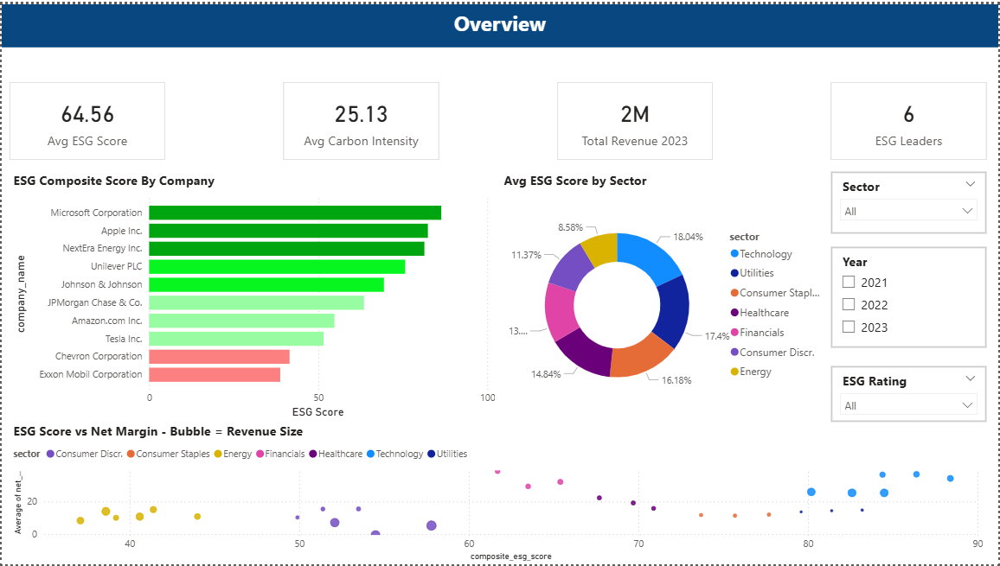
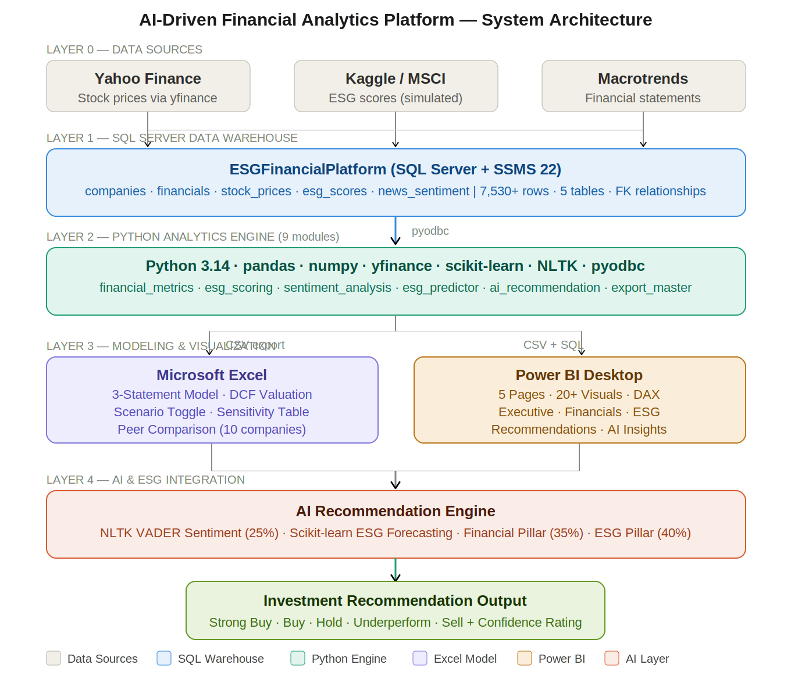

# 🤖 AI-Driven ESG Financial Analytics Platform





> An end-to-end financial analytics platform simulating real-world investment banking workflows —
> integrating **SQL, Python, Excel and Power BI** with **AI-driven ESG scoring, NLP sentiment
> analysis and ML-based ESG forecasting** to generate investment recommendations across a
> 10-company S&P 500 coverage universe.

---

## 🏗️ System Architecture
```
Data Sources (Yahoo Finance, Kaggle ESG, Simulated News)
         ↓
Layer 1: SQL Server Data Warehouse (5 tables, 7,100+ rows)
         ↓
Layer 2: Python Analytics Engine (9 modules)
         ↓
    ┌────┴────┐
    ↓         ↓
Layer 3:   Layer 4:
Excel      Power BI
DCF Model  Dashboard
    ↓         ↓
    └────┬────┘
         ↓
Layer 5: AI & ESG Enhancement
(Sentiment + ML Prediction + Recommendation Engine)
```

---

## 📊 Coverage Universe

| Ticker | Company | Sector | ESG Rating |
|--------|---------|--------|------------|
| MSFT | Microsoft Corporation | Technology | AAA |
| AAPL | Apple Inc. | Technology | AAA |
| NEE | NextEra Energy | Utilities | AAA |
| UL | Unilever PLC | Consumer Staples | AA |
| JNJ | Johnson & Johnson | Healthcare | AA |
| JPM | JPMorgan Chase | Financials | AA |
| AMZN | Amazon.com Inc. | Consumer Discretionary | A |
| TSLA | Tesla Inc. | Consumer Discretionary | A |
| CVX | Chevron Corporation | Energy | BBB |
| XOM | Exxon Mobil | Energy | BBB |

---

## 🗂️ Project Structure
```
esg-financial-analytics-platform/
│
├── python/
│   ├── db_connection.py          ← SQL Server connector
│   ├── ingest_stock_prices.py    ← yfinance data pipeline
│   ├── financial_metrics.py      ← Ratio calculations
│   ├── esg_scoring.py            ← ESG composite scoring
│   ├── sentiment_analysis.py     ← NLTK VADER NLP
│   ├── esg_predictor.py          ← ML ESG forecasting
│   ├── ai_recommendation.py      ← AI scoring engine
│   ├── export_master.py          ← Data export pipeline
│   └── pipeline_validation.py    ← End-to-end validator
│
├── sql/
│   ├── schema.sql                ← Database schema & tables
│   └── queries.sql               ← Analytical queries
│
├── data/processed/
│   ├── master_dataset.csv
│   ├── financial_metrics.csv
│   ├── esg_scores_processed.csv
│   ├── esg_investment_tiers.csv
│   ├── esg_predictions_full.csv
│   ├── sentiment_scores.csv
│   ├── esg_predictions_2024.csv
│   └── ai_recommendations.csv
│
├── excel/
│   └── financial_model.xlsx      ← 7-sheet DCF model (Apple Inc.)
│
├── powerbi/
│   └── ESG_Dashboard.pbix        ← 5-page interactive dashboard
│
├── docs/
│   ├── architecture_diagram.svg
│   └── ESG_Project_Summary.docx
│
└── requirements.txt
```

---

## ⚙️ Key Features

### 🗄️ SQL Data Warehouse
- 5 normalized tables with foreign key relationships
- 7,100+ rows across companies, financials, stock prices, ESG scores and news sentiment
- T-SQL analytical queries for ESG vs financial performance

### 🐍 Python Analytics Engine (9 Modules)
- Automated stock price ingestion via `yfinance` API
- Financial ratio computation (margins, CAGR, ROE)
- Weighted ESG composite scoring — Environmental 40%, Social 30%, Governance 30%
- ESG-adjusted WACC framework (±75bps based on ESG rating)

### 📊 Excel Financial Model (Apple Inc.)
- Full 3-statement model (FY2021–FY2026E)
- DCF valuation with ESG-adjusted WACC
- Dynamic Bear / Base / Bull scenario toggle
- Sensitivity table (WACC × Terminal Growth Rate)
- Peer comparison across all 10 companies

### 📈 Power BI Dashboard (5 Pages)
- Executive Overview with KPI cards
- Financial Performance analysis
- ESG Deep Dive with sub-score breakdown
- Investment Recommendations with tier coloring
- AI Insights with sentiment and predictions

### 🤖 AI & ESG Integration
- NLTK VADER sentiment analysis across 60 headlines
- Scikit-learn Linear Regression ESG forecasting
- 3-pillar AI scoring — Financial 35%, ESG 40%, Sentiment 25%
- Confidence-rated investment recommendations

---

## 🎯 AI Recommendation Results (FY2023)

| Ticker | AI Score | Recommendation | Confidence |
|--------|----------|----------------|------------|
| MSFT | 75.22 | ✅ Strong Buy | Medium |
| AAPL | 74.25 | ✅ Strong Buy | Medium |
| NEE | 61.21 | 🟢 Buy | Low |
| JPM | 53.03 | 🟡 Hold | Low |
| UL | 48.86 | 🟡 Hold | Low |
| JNJ | 46.24 | 🟡 Hold | Low |
| AMZN | 42.52 | 🟠 Underperform | Low |
| TSLA | 32.70 | 🟠 Underperform | Medium |
| CVX | 28.65 | 🔴 Sell | Medium |
| XOM | 18.55 | 🔴 Sell | High |

---

## 💡 Key Analytical Insights

1. **ESG Premium** — AAA-rated companies (MSFT, AAPL, NEE) receive a 75bps WACC reduction vs BBB-rated energy majors, directly impacting intrinsic value
2. **ESG-Margin Correlation** — Technology sector shows the strongest positive correlation between ESG score and net profit margin
3. **Sentiment Divergence** — CVX shows positive news sentiment (+0.33) despite a poor ESG score (44.0), illustrating why multi-factor models outperform single-metric approaches
4. **Energy Transition** — NEE (clean energy) shows 43.6% revenue CAGR vs XOM's 20.9%, supporting the ESG-growth thesis

---

## 🚀 How to Run

### Prerequisites
- Python 3.10+
- Microsoft SQL Server + SSMS
- Power BI Desktop (free)
- Microsoft Excel

### Setup
```bash
# Install dependencies
pip install -r requirements.txt

# Run the full pipeline in order:
python python/db_connection.py
python python/ingest_stock_prices.py
python python/financial_metrics.py
python python/esg_scoring.py
python python/export_master.py
python python/sentiment_analysis.py
python python/esg_predictor.py
python python/ai_recommendation.py
python python/pipeline_validation.py
```

### Database
```sql
-- Run in SSMS:
-- 1. sql/schema.sql    (create tables)
-- 2. sql/queries.sql   (run analytical queries)
```

---

## 🛠️ Skills Demonstrated

`Python` `SQL` `Power BI` `Excel` `DAX` `Machine Learning` `NLP`
`Financial Modelling` `DCF Valuation` `ESG Analysis` `Data Pipeline` `Investment Research`

---

## 👤 Author

**Vansh Goyal**
- 📧 [vggoyal2304@gmail.com]

---

## ⚠️ Disclaimer

> Built for educational and portfolio purposes.
> Does not constitute financial advice or a recommendation to buy or sell any security.
> All data sourced from publicly available sources (Yahoo Finance, Kaggle).
